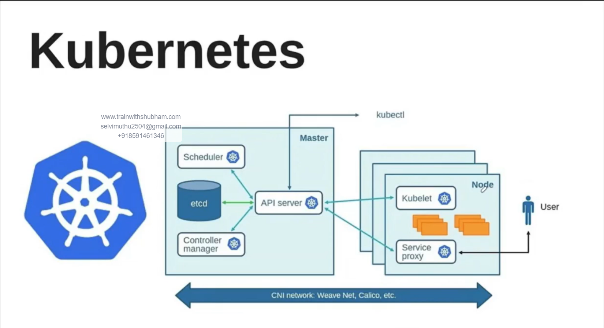
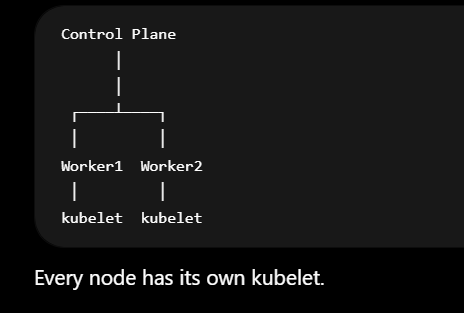

# Kubernetes Archetcture 

# Basics of Server

## What is a Server?
    A server is simply a machine.
    It can be: Physical machine, Virtual Machine (VM), EC2 Instance, VPS
    Examples: EC2 Instance, Ubuntu VM, Dell Physical Server
    All of these are servers.

## What is a Node?
    In Kubernetes, a server that joins the Kubernetes environment is called a Node.
    Server -> Joined Kubernetes -> Node
    Example: EC2-1, EC2-2, EC2-3

    Before Kubernetes: 3 Servers
    After joining Kubernetes: 3 Nodes

    So: Every node is a server, but not every server is necessarily a Kubernetes node.

## Kubctl ?
    No matter how the Kubernetes cluster is created, kubectl is usually the primary tool used to access and manage it.

## 1. Number of Ways K8 Cluster Creation Tools.

### 1) kubeadm
    : Official Kubernetes tool.

### 2) Kind
    : Creates Kubernetes inside Docker containers.

### 3) Minikube 
    : Single-node Kubernetes.

## 2. Managed Kubernetes Services
    : Cloud providers create and manage the control plane.

### 1) Amazon Elastic Kubernetes Service (EKS)
    : AWS manages:
    - API Server
    - etcd
    - Scheduler
    - Controllers
    You manage workloads.

### 2) Google Kubernetes Engine (GKE)
### 3) Google's managed Kubernetes.

## 3. Cluster Management
    After the cluster exists, you manage it. kubectl Official Kubernetes CLI.
    Examples:
    kubectl get pods
    kubectl get nodes
    kubectl apply -f app.yaml

### 4. Package Management
    Installing applications manually becomes hard. Example:Prometheus,Grafana,Jenkins,ArgoCD

    Helm
    Like: apt for Ubuntu
          yum for RHEL
        but for Kubernetes.
    Install Grafana:
    helm install grafana ...

## kubelet ?
    kubelet is one of the most important Kubernetes components.
    If someone asks: "What actually runs my Pods on a node?"
    The answer is: kubelet + container runtime (containerd)

## What is kubelet?
    kubelet is a node agent. It runs as a service on every Kubernetes node.

## How Master(Control Plene) communicate with Worker??
    Problem:
    Solution: CNI

