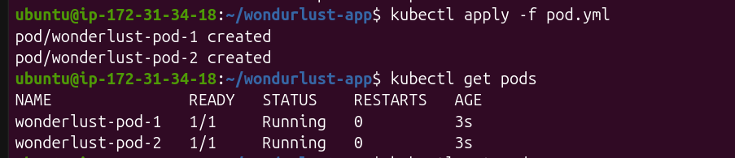
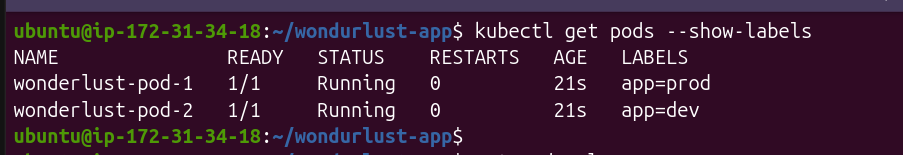
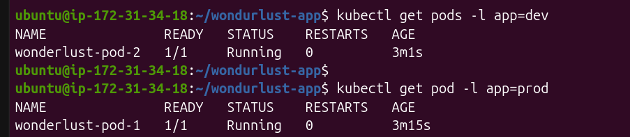

# Labels:
    Suppose I have 3 Pods Running from the Dev and 10 is running for the Prod if i did > kubectl get pods it will show me all pods but how i will identify that which pods belong to which environment so that why lables comes into the picture.

    we basically gives exrta identiy to the pods 

    Ex- labels:
            app: wonderlust-app
            env: prod

# Selectors:
    Selectors search for labels.
    Exaple:

    > kubectl get pods -l app=wanderlust

    Think of it like SQL:
    SELECT * FROM pods
    WHERE app='wanderlust'

# Run The Latest yml with multiple labels 
    > kubectl apply -f pod.yml
    > kubectl get pods
    > kubectl get pods --show-labels

    > kubectl get pods -l app=dev
    > kubectl get pods -l app=prod

