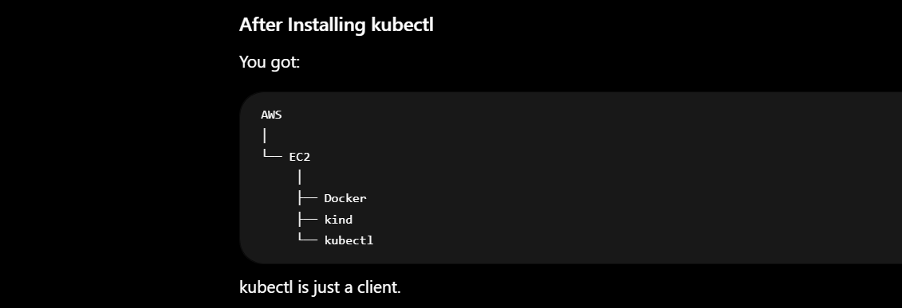
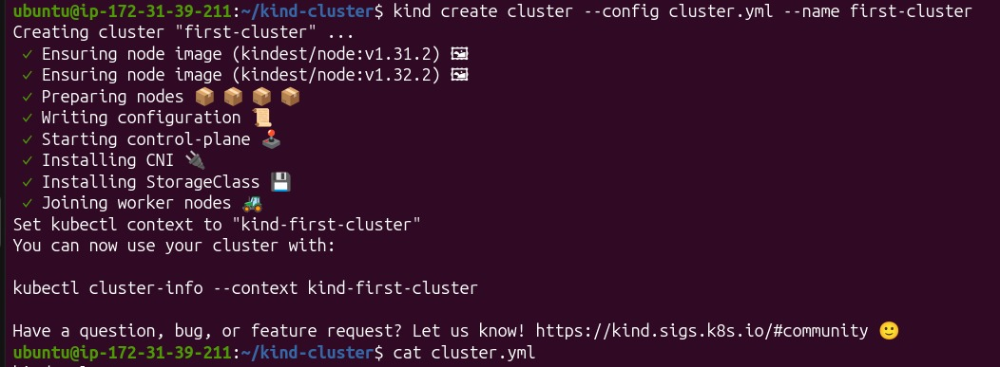
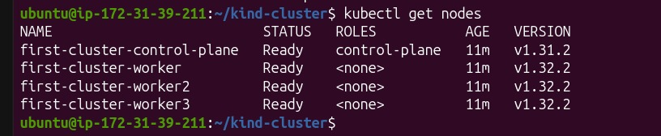
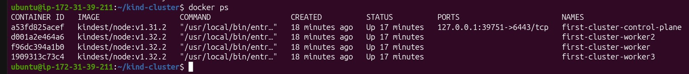
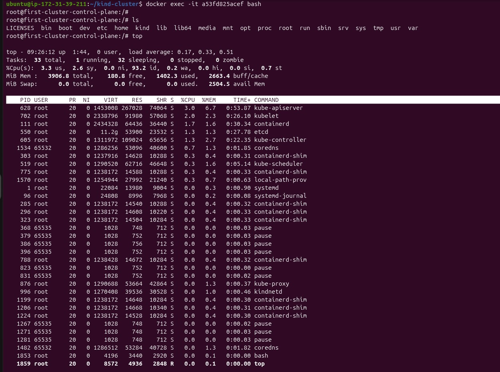
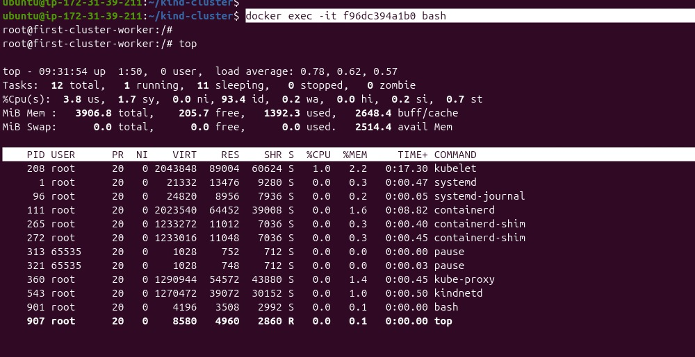

# Setup of K8 Cluster

## Step 1: Launch EC2 
## Step 2: Software Installation 
    sudo apt-get update 
    sudo apt-get upgrade -y 
Note: I decided i will go with Kind k8 cluster.

    1) Install Docker 
    2) Install kind 
    3) Insall kubectl

## Insall Docker 
    > sudo apt-get install docker.io
    > docker -v
    > sudo usermod -aG docker ubuntu
    > newgrp docker

## Install Kind 
    > [ $(uname -m) = x86_64 ] && curl -Lo ./kind https://kind.sigs.k8s.io/dl/v0.31.0/kind-linux-amd64
    > ls
    > chmod +x ./kind
    > ./kind --version
    > sudo mv ./kind /usr/local/bin/kind
    > kind --version 

    
## Insall Kubectl 
    > curl -LO "https://dl.k8s.io/release/$(curl -L -s https://dl.k8s.io/release/stable.txt)/bin/linux/amd64/kubectl"
    > ls
    > chmod +x ./kubectl
    > ./kubectl version
    > sudo mv ./kubectl /usr/local/bin/kubectl

    > kubectl version

## Note: 
    It doesn't create Kubernetes. It talks to Kubernetes.
    Example:
    kubectl get nodes
    kubectl get pods
    kubectl create deployment nginx

# ------------------------------------------------------------------------------------------------------

## Step 1: Let's Create Kind Configuration file.
    A kind configuration file also know as manifest file.
    A manifest file is simply a file that describes what you want Kubernetes to create.
    in this file we define all the detailed about of K8 cluseter such as about Control Plane, worker node, networking, 
    Storage etc

    > mkdir kind-cluster
    > cd kind-cluster
    > sudo vi cluster.yml

    kind: Cluster
    apiVersion: kind.x-k8s.io/v1alpha4

    nodes:
    - role: control-plane
    image: kindest/node:v1.31.2

    - role: worker
    image: kindest/node:v1.32.2

    - role: worker
    image: kindest/node:v1.32.2

    - role: worker
    image: kindest/node:v1.32.2

## 
    > kind create cluster --config cluster.yml --name first-cluster

## Step 2: Now list all Nodes 
    > kubectl get nodes

    > docker ps 

    at the end 4 docker container means mini ubuntu machien is running.

# +----------------------------------------------------------------+
# Understand the COncept:
    Each node is a "mini virtual machine-like environment" running as a Docker container. Not a real VM, but from Kubernetes' perspective it looks like a node.

    Either run 4 EC2 and join 3 and consider them as worker and 1 will be as master but in our case with docker we did in one ec2 and these becomes 4 node cluser menas 1 k8 cluser.

# Lets Exec and Understand what Running inside Master Container 
    > docker exec -it a53fd825acef bash

# Lets Exec and Understand what Running inside Owrker Container 
    > docker exec -it f96dc394a1b0 bash

