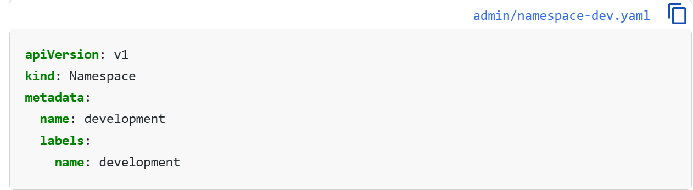

# Check Existing Namespace 

    > kubectl get ns
        

# Create Namespace 
We Can Create Namespace usign two methods

## Number 1 - Imperative Command
Run the direct CLI command. kubectl create namespace <name> (or shorthand kubectl create ns <name>). 

    > kubectl create namespace development

## Number 2 - Declarative Manifest (YAML)
kind: Namespace and apply it using kubectl apply -f <file.yaml> or kubectl create -f <file.yaml>

Or File Based Create Namespace

    > kubectl apply -f namespace.yml

# Make it Default Namespace
So Each time to get any pods we have to to define the namesapnce name but if we define rhe default namesapce we dont have to defines always.

    > kubectl config set-context --current --namespace=development

Verify: 

    > kubectl config view --minify

## Problem:
Everytime we have to define in which namesapce you are looking your resource. suppose i am looking total number of pods running in development.

    > kubectl get pods -n development

and i need to check multiple things always in development so i have to mention -n namespace always. better to set the defaul this one.

# Deploy into Namespace

    > kubectl create deployment nginx --image=nginx -n dev
    > kubectl get pods -n dev