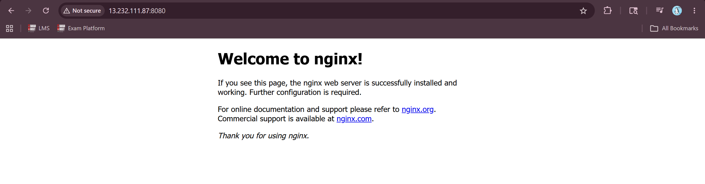

# Apply Service
    > kubectl apply -f service.yml

# Describe Service
    > kubectl get svc -n development
    list all service that comes under development namespace

    > kubectl describe svc nginx-svc -n development
    Describe specific service which come under development namespace 

# Port Forwording 
    > kubectl port-forward svc/nginx-svc -n development 8080:82 --address=0.0.0.0

