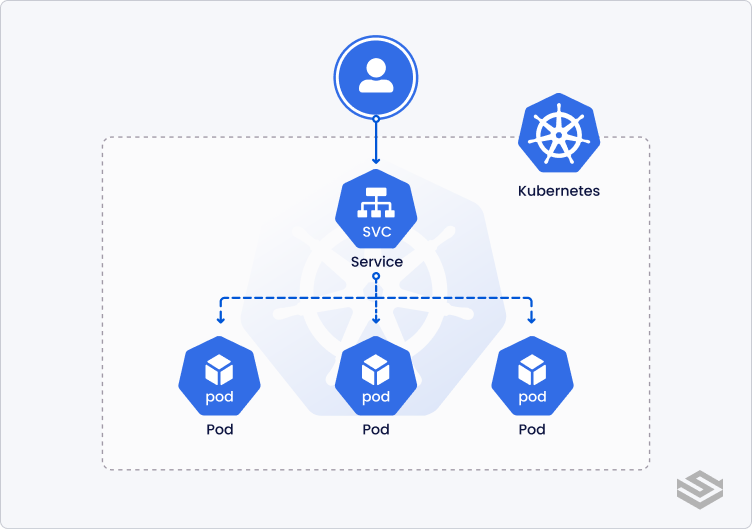

# Service 
    How do users or other applications reach my Pods? That's exactly why Services exist.
    A Service provides a stable IP and DNS name in front of Pods.

## The Problem Before Service
    Suppose you create a Deployment:

    Deployment
        ↓
    ReplicaSet
        ↓
    Pod-1 (10.244.1.5)
    Pod-2 (10.244.1.6)
    Pod-3 (10.244.1.7)

Each Pod gets an IP.

    Problem:
    Today:
    Pod-1 = 10.244.1.5
    Tomorrow:
    Pod-1 crashes
    New Pod-4 = 10.244.1.10

The IP changed. If your frontend connects directly to: 10.244.1.5 it breaks.

## What Service Solves
    A Service provides a stable IP and DNS name in front of Pods.

    Client
        ↓
    Service
        ↓   
    Pod-1
    Pod-2
    Pod-3

## Simple Analogy
Imagine a restaurant.

    Customers
        ↓
    Reception Desk
        ↓
    Waiter1
    Waiter2
    Waiter3

## How Service Finds Pods ?
    Kubernetes says: Find all Pods with label app=nodeapp
    Example:
    Pod1 app=nodeapp
    Pod2 app=nodeapp
    Pod3 app=nodeapp

## Understanding Ports
    Suppose Node.js runs on: Container Port = 3000
    Service: port: 80
             targetPort: 3000
    
    Meaning: Client → Service:80
               ↓
            Pod:3000

# Service Types
1. ClusterIP
2. NodePort
3. LoadBalancer (AWS/GLB)
4. ExternalName
5. Headless Service (Generally work with Stateless Set)

# 1. ClusterIP(Default):
    
    kind: Service
    spec:
    type: ClusterIP

    Most common. -> Creates: Virtual IP -> accessible only inside Kubernetes.

    Example: Frontend Service 10.96.0.15
    Backend can access: http://frontend-service

## Note: 
    But internet users cannot.

    # Why ClusterIP Was Created
        Problem: Pod IP changes frequently
        Solution: Stable internal IP

# 2. NodePort: 
    Then people asked: How do I access my application from outside Kubernetes?
    ClusterIP cannot. So Kubernetes introduced:
    type: NodePort

Example:
spec:
  type: NodePort
  ports:
    - port: 80
      nodePort: 30080

### Now:
    Node IP = 13.200.x.x
    Port    = 30080

    Access: http://13.200.x.x:30080

    Problem Solved Before NodePort: No external access
    After NodePort: External access available

### Problems With NodePort
Imagine:
    Frontend -> 30080
    Backend  -> 30081
    Admin    -> 30082

Users need ports. Ugly. Not enterprise-friendly.

# 3. LoadBalancer:
    Cloud providers introduced:
    type: LoadBalancer

Example:
spec:
  type: LoadBalancer

## AWS automatically creates:
    ELB, ALB, NLB
    depending on configuration.

    Problem Solved. Users no longer need:
     :30080, Instead: app.company.com

### New Problem
Imagine:
    Frontend Service
    Backend Service
    Admin Service

    Each: type: LoadBalancer
    AWS creates:
    LB #1
    LB #2
    LB #3

#->    Expensive. This eventually led to Ingress.
